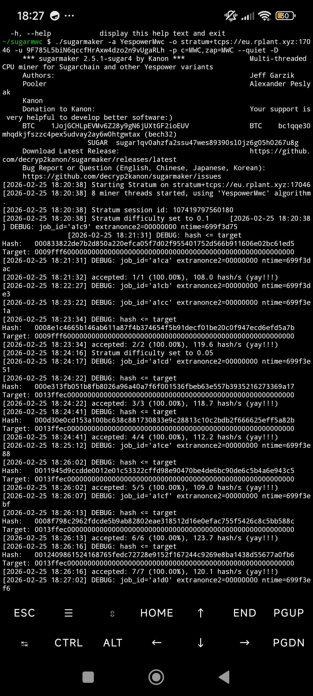

# Frequently Asked Questions

---

## Table of Contents

- [1. How do I get Core Wallet?](#1-how-do-i-get-core-wallet)
- [2. How do I mine on Android?](#2-how-do-i-mine-on-phone)
- [3. How do I mine on Android with SugarMaker via Termux (no proot)?](#3-how-do-i-mine-on-android-with-sugarmaker-via-termux-no-proot)

---

## 1. How do I get Core Wallet?

### Download

👉 [Download the latest release](https://github.com/AdventureCoin-ADVC/AdventureCoin/releases/latest)
 
Pick the file that matches your platform:
 
| Platform | Architecture | File to download |
|----------|-------------|-----------------|
| Windows | 64-bit *(most modern PCs)* | `x86_64-win` |
| Windows | 32-bit *(older PCs)* | `i686-win` |
| macOS | Intel | `x86_64-macos` |
| Linux | 64-bit | `x86_64-linux` |
| Linux | 32-bit | `i686-linux` |
| Linux ARM | 64-bit *(Raspberry Pi 4/5, ARM SBCs)* | `aarch64-linux` |
| Linux ARM | 32-bit *(Raspberry Pi Zero 2, Pi 3)* | `armhf-linux` |
 
> Not sure which Windows version you have? Press `Win + Pause/Break` or search *"About your PC"* — it will say 64-bit or 32-bit under **System type**.

### Setup

1. After downloading, open the `bin` folder and launch the **QT** executable.
2. Once the wallet is open, go to **Help → Debug Window → Console**.
3. In the console, add the peer nodes by running each of the following commands:

```
addnode "15.235.225.214" add
addnode "145.239.3.70" add
addnode "149.202.91.156" add
addnode "51.15.18.216" add
addnode "51.222.240.201" add
addnode "5.178.110.159" add
addnode "66.42.91.98" add
addnode "164.132.169.5" add
```

> Each command will return `null` — this is expected. Wait for the wallet to sync with the network before continuing.

> 💡 **Need more nodes?** Find additional addnodes here: [AdventureCoin Explorer — Addnodes](https://adventurecoin-advc.github.io/AdventureCoin-Explorer/addnodes.html#/)

### Generate Your Wallet Address

1. Once synced, go to the **Receive** tab and click **Request Payment**.
2. This generates your wallet address.

### Export Your Private Key

1. Go back to the console (**Help → Debug Window → Console**).
2. Run the following command, replacing `YOURADDRESSGOESHERE` with your actual address:

```
dumpprivkey "YOURADDRESSGOESHERE"
```

3. This outputs your private key, which can be imported into any compatible wallet — including the web wallet.

---

## 2. How do I mine on phone?

> ⚠️ **Important:** Always use Core Wallet — **not** the web wallet — before mining. If you mine to a web wallet address you do not control, your funds may be unrecoverable.

### Steps

1. Make sure you have your **Core Wallet** set up and have a wallet address ready (see [FAQ #1](#1-how-do-i-get-core-wallet)).
2. Download the Android miner APK from the latest release:
   👉 [MinersWorldCoin Android Miner Releases](https://github.com/Miners-World-Coin-MWC/MinersWorldCoin-Android-Miner/releases)
3. Install and open the APK and enter the following pool details:

| Field | Value |
|-------|-------|
| **Username** | Your AdventureCoin wallet address |
| **Password** | anything |
| **Algorithm** | `yespowerADVC` |
| **URL** (difficulty 0.5) | `stratum+tcp://bmine.net:3044` |

> For the latest updates and troubleshooting, join the **Discord server**.

---

## 3. How do I mine on Android with SugarMaker via Termux (no proot)?

This guide walks you through building and running **SugarMaker** directly in Termux — no proot or root access required.

> ⚠️ **Important:** Have your wallet address ready before you start. Use **Core Wallet** (not the web wallet) to generate one — see [FAQ #1](#1-how-do-i-get-core-wallet).

### Step 1 — Install Termux

Download Termux from **F-Droid** (do not use the Play Store version — it is outdated):

👉 [https://f-droid.org/pt/packages/com.termux/](https://f-droid.org/pt/packages/com.termux/)

### Step 2 — Set Up Termux

Open Termux and run the following commands in order:

**Keep the CPU awake while mining:**
```bash
termux-wake-lock
```

**Update packages:**
```bash
pkg update -y && pkg upgrade -y
```

**Install dependencies:**
```bash
pkg install git build-essential clang make automake autoconf libtool binutils openssl libcurl libjansson libgmp autoconf automake libtool -y
```

### Step 3 — Clone SugarMaker

```bash
git clone https://github.com/Miners-World-Coin-MWC/sugarmaker.git sugaradvc
cd sugaradvc
```

### Step 4 — Build

Run the build scripts:

```bash
./autogen.sh
```

Then configure. Try the optimized version first:

```bash
./configure --disable-assembly CFLAGS="-O3 -march=native" LDFLAGS="-lcurl -lssl -lcrypto"
```

> If you get an error, fall back to the simpler configure:
> ```bash
> ./configure --disable-assembly
> ```

Then compile:

```bash
make -j$(nproc)
```

### Step 5 — Start Mining

```bash
./sugarmaker -a YespowerAdvc -o PoolOfYourChoose -u YourWallet -p c=ADVC,zap=ADVC --quiet -D
```

Replace the placeholders before running:

| Placeholder       | Replace with                        |
|-------------------|-------------------------------------|
| `PoolOfYourChoose` | Your pool URL (e.g. `stratum+tcp://pool.example.com:3333`) |
| `YourWallet`       | Your ADVC wallet address            |

> For pool options, latest updates, and troubleshooting, check the **Discord server**.

### What Success Looks Like

Once running, you should see shares being accepted with 100% rate and your hashrate reported in h/s — like this:



> The output above shows 7/7 accepted shares at ~120 h/s using the `YespowerMwc` algorithm on the rplant pool. Your hashrate will vary depending on your device.

---

*More FAQs coming soon. Have a question? Open an issue or ask in Discord.*
